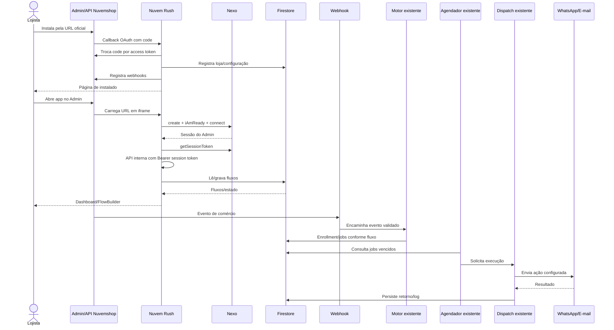

# Diagrama de sequência para homologação

Baseado no código existente. Scheduler/dispatch são mostrados apenas como componentes observados, sem inferir garantias operacionais.

Pontos a demonstrar: instalação, handshake Nexo, leitura/escrita de fluxo, evento, criação de job, execução controlada e evidência do resultado. A precisão/robustez do scheduler e dispatch pertence à trilha paralela e não foi certificada aqui.
